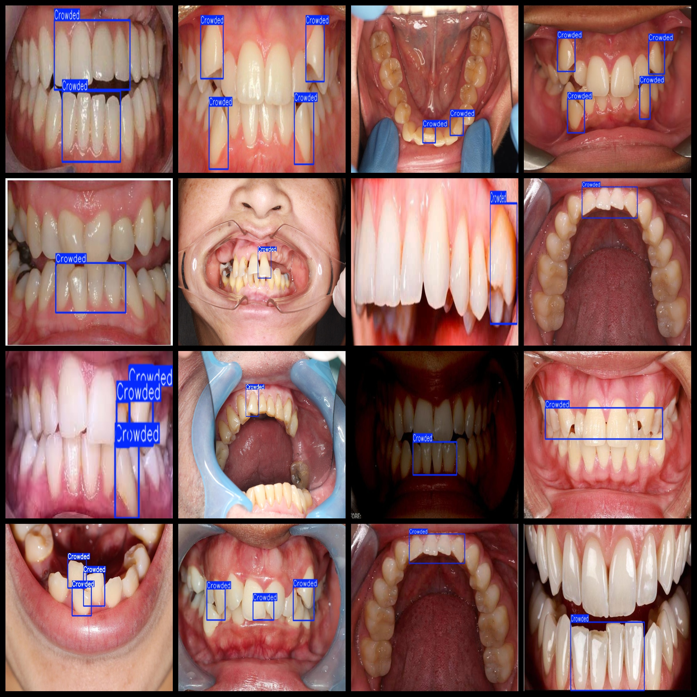

# Teeth Irregular Detection Dataset 393 imagesVOC+YOLO format

Tooth Irregularity Detection Dataset 393 sheets VOC + YOLO format

Dataset format: Pascal VOC format + YOLO format (the txt file does not contain the split path, it only contains jpg images and corresponding VOC format xml files and yolo format txt files)

Number of images (number of jpg files): 393

Marked the number of xml files: 393

Mark the number of txt files: 393

Number of categories: 1

The Github repository is: datasets_sl

Crowded

Number of boxes labeled in each category:

Crowded frame count = 667

Total Frames: 667

Number of images per category:

Crowded occupancy = 393

Resolution of the image: Multiple resolution images, such as 580x294, 1280x720, etc.

Use the labeling tool: labelImg

Dataset Augmentation: No

Rules for annotation: Draw a rectangle around the category.

Important note: The dataset does not have been divided into training, validation, and testing sets.

Special Disclaimer: This dataset does not guarantee the accuracy of the trained models or weight files.

Annotation and image details are as follows:

## Images

---

Here is a pay link on Stripe (https://buy.stripe.com/3cs8yP7sY87d0vu9AB). Please contact me lonlonago@foxmail.com after funding $89, and I will send you a complete data files, thank you!

